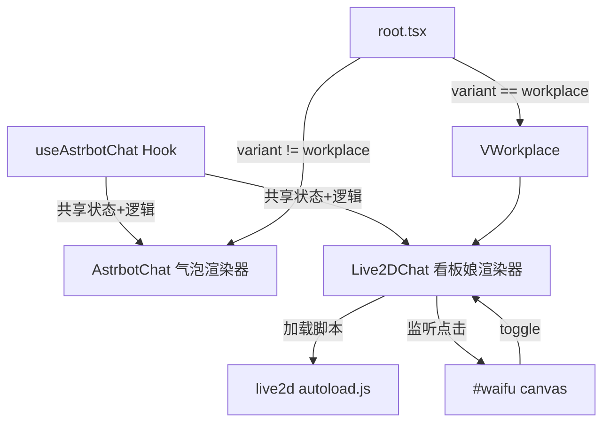

## 用户需求

将右下角 AstrBot 聊天气泡移植到 Live2D 看板娘角色上，实现点击看板娘打开 AstrBot 聊天面板的效果。同时修复 Live2D 依赖的 CSP 缺失（hitokoto.cn 被 connect-src 拦截）。

## 核心功能

1. **CSP 修复**：将 `https://v1.hitokoto.cn` 加入 `connect-src` 指令，解决 Live2D 一言 API 被拦截问题
2. **看板娘聊天集成**：修改 `live2d-widget.tsx`，在 Live2D 加载完成后监听 `#waifu` 元素的点击事件，触发 AstrBot 聊天面板的打开/关闭
3. **AstrBot 面板重构**：将 `AstrbotChat` 的聊天逻辑提取为可复用的 hook (`useAstrbotChat`)，使 Live2D 组件和原有浮动气泡组件共享同一套聊天逻辑
4. **Workplace 变体切换**：在 Workplace 变体中，隐藏右下角独立的 AstrBot 浮动气泡（`AstrbotChat`），改为由 Live2D 看板娘触发的聊天面板（锚定左下角）
5. **面板定位**：聊天面板在 Live2D 角色附近（左下角区域）弹出，而非右下角

## 技术方案

### 实现策略

采用**共享 Hook + 双渲染器**模式：将 AstrBot 聊天的所有状态管理与业务逻辑（流式响应、文件上传、sessionStorage 同步、拖拽等）提取为一个独立的 `useAstrbotChat` hook，然后由两个不同的渲染器消费：

- **`AstrbotChat`（右下角气泡渲染器）**：保持现有外观不变，在非 Workplace 变体中继续作为右下角浮动气泡 + 面板
- **`Live2DChat`（左下角 Live2D 渲染器）**：新组件，加载 Live2D 脚本、监听 `#waifu` 点击、使用同一 hook 驱动聊天面板，面板锚定在左下角

### 关键设计决策

1. **Hook 提取而非代码复制**：`useAstrbotChat` 封装全部聊天状态（messages, input, loading, sessionId, attachment 等）和发送逻辑（send 函数），两个渲染器通过 props 或返回值共享。避免 469 行代码重复，单一真相源。

2. **Live2D 点击拦截**：`autoload.js` 自注入后创建 `#waifu` 元素。在 script onload 后使用 `MutationObserver` 或轮询检测 `#waifu` 出现，然后对其内部的 `<canvas>` 附加 `click` 事件监听。不覆盖 Live2D 的原生拖拽行为，仅劫持点击。

3. **变体感知的 AstrBot 渲染**：在 `root.tsx` 中，当 `variant === 'workplace'` 时不渲染 `<AstrbotChat />`（通过 props 传递 variant 状态）；`VWorkplace` 内部使用 `<Live2DChat />` 替代旧的 `<Live2DWidget />`。

4. **面板定位复用**：`getPanelPos()` 逻辑从 `AstrbotChat` 提取到共享 hook 中，`Live2DChat` 传入 `anchor: 'bottom-left'` 参数来计算左下角锚定位置。

### 性能与可靠性

- **避免重复注入**：`live2d-autoload` script 和 `#waifu` 检测使用单例 ID 保证只加载一次
- **事件清理**：Live2D 的 click listener 在组件卸载时移除，`wp:bus` 监听保持不变
- **sessionStorage 共享**：两个聊天渲染器使用相同的 `mola:chat-sid` / `mola:chat-messages` key，确保跨变体聊天记录同步
- **CSP 最小扩散**：只添加必要的 `connect-src` 来源，不扩大攻击面

### 架构设计



### 目录结构

```
components/redesign/
├── astrbot-chat.tsx          # [MODIFY] 提取 useAstrbotChat hook 导出，AstrbotChat 变成薄渲染层
├── live2d-widget.tsx         # [MODIFY] 重命名为 Live2DChat，集成 useAstrbotChat + Live2D 加载 + #waifu 点击监听
├── workplace-mascot.tsx      # [DELETE] 旧的 GIF Miku 组件，不再使用
├── v-workplace.tsx           # [MODIFY] 替换 Live2DWidget → Live2DChat
└── root.tsx                  # [MODIFY] 当 variant === 'workplace' 时隐藏 AstrbotChat
next.config.mjs               # [MODIFY] connect-src 添加 https://v1.hitokoto.cn
```

### 关键代码结构

`useAstrbotChat` hook 接口设计：

```ts
// lib/chat/use-astrbot-chat.ts
export function useAstrbotChat(options?: {
  anchor?: 'bottom-right' | 'bottom-left';
}) {
  return {
    // State
    open: boolean;
    setOpen: (v: boolean) => void;
    messages: Message[];
    input: string;
    setInput: (v: string) => void;
    loading: boolean;
    configured: boolean | null;
    // Actions
    send: () => Promise<void>;
    clearAttachment: () => void;
    onPickFile: (e: ChangeEvent) => void;
    // Panel positioning
    panelStyle: CSSProperties;
    // Ref for drag
    bubbleRef: RefObject<HTMLDivElement>;
    onMouseDown: (e: MouseEvent) => void;
    // Session
    sessionId: string;
  };
}
```

`live2d-chat.tsx` 组件结构：

```
export function Live2DChat() {
  const chat = useAstrbotChat({ anchor: 'bottom-left' });
  
  // Load Live2D script (existing logic from live2d-widget.tsx)
  useLive2DLoader();
  
  // Detect #waifu creation + bind click
  useWaifuClick(() => chat.setOpen(!chat.open));
  
  // Render chat panel (no bubble, panel anchored bottom-left)
  return chat.open ? createPortal(<ChatPanel chat={chat} />, document.body) : null;
}
```

## Agent Extensions

### SubAgent

- **code-explorer**
- Purpose: 深入探索 `astrbot-chat.tsx` 的完整实现细节（流式 SSE 解析、附件上传、拖拽逻辑、sessionStorage 同步），确保 hook 提取时不遗漏任何状态或副作用
- Expected outcome: 获得完整的 AstrBotChat 状态图与副作用列表，指导 useAstrbotChat hook 的精确切割