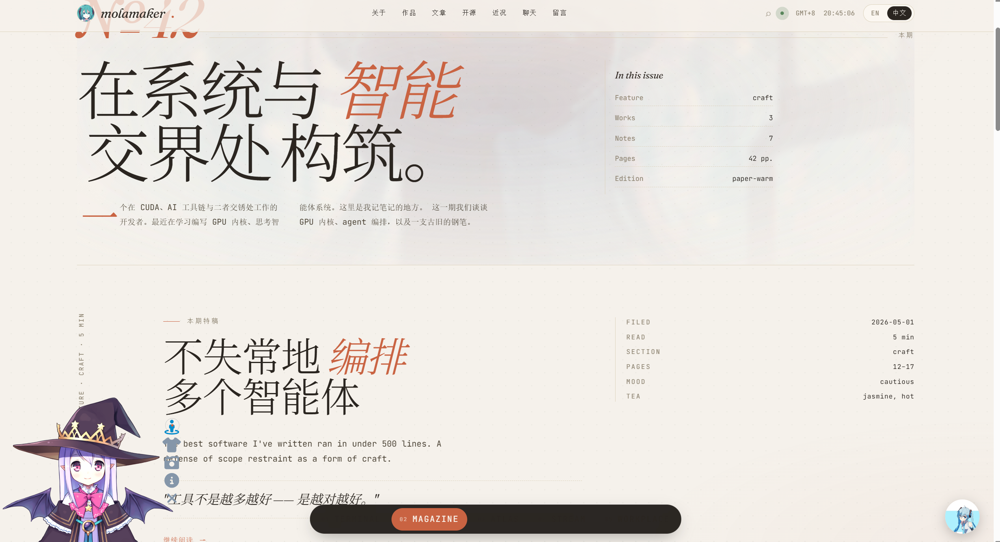
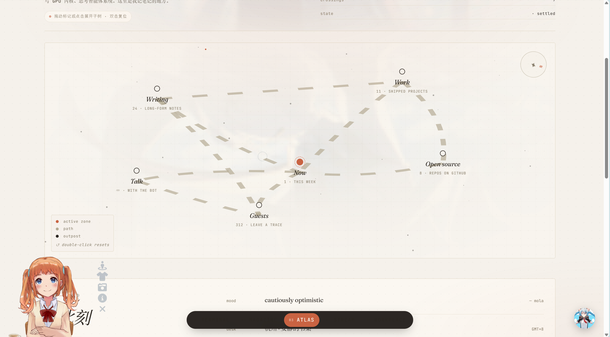
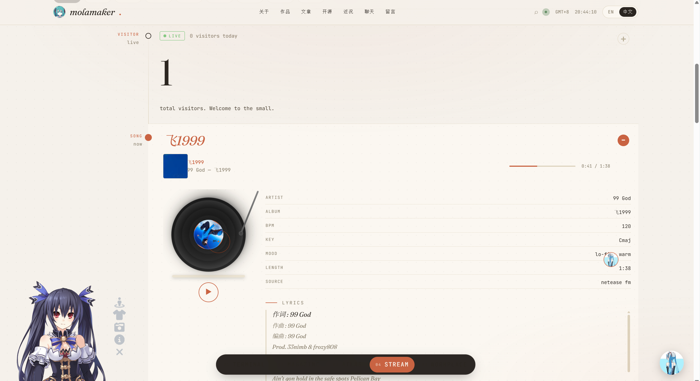
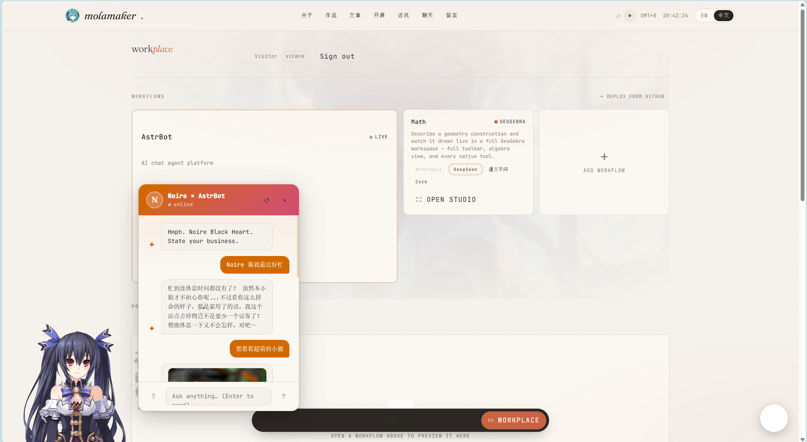
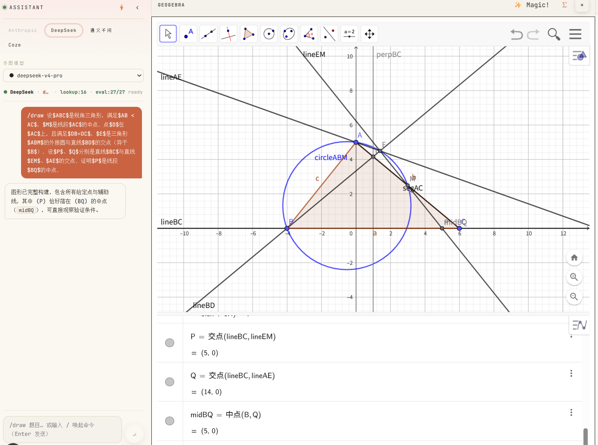
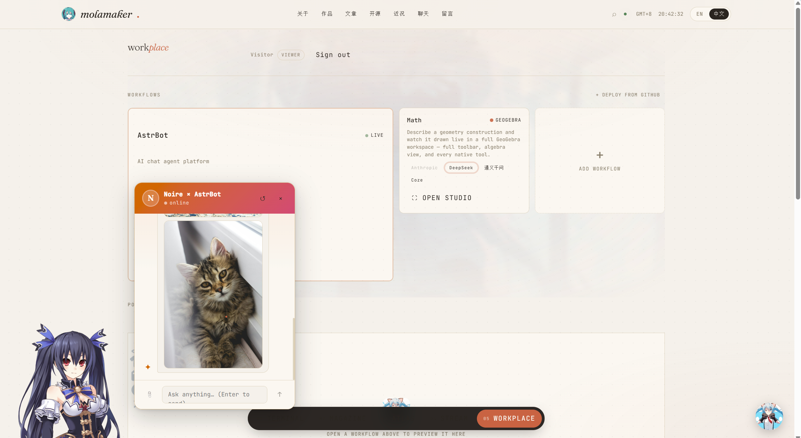

<div align="center">

# molamaker · 墨拉工坊

**One person. One dataset. Six ways to experience it.**

A Claude-style personal **portfolio + journal** that renders the *same* live data
(repos, posts, music, guestbook, visitors) through six switchable visual
"variants" — plus a self-hosted **Workplace** with an AI mascot, an AI-powered
geometry studio, and real authentication.

[English](./README.md) · [简体中文](./README_zh.md)




</div>

---

## ✨ What is this?

`molamaker-site` is a personal site built around one idea: **your data shouldn't
be locked to one layout.** A single source of truth — GitHub repos, blog posts,
now-playing music, guestbook entries, visitor counts — is fed into six
independent "variants." Switch between them from the bottom dock and the same
content re-renders as a magazine, a star map, a music stream, a workspace, and
more.

| # | Variant | What it feels like |
|---|---------|--------------------|
| 01 | **Terminal** | A typed, command-line homepage. The default landing experience. |
| 02 | **Magazine** | A bilingual editorial spread with big display type. |
| 03 | **Atlas** | A constellation map — sections become nodes you navigate. |
| 04 | **Stream** | A live "now" feed with a working vinyl music player. |
| 05 | **Workplace** | A logged-in workspace: AI mascot, Math Studio, kanban. |
| 06 | **Notebook** | A quiet, paper-like reading layout. |

Everything is **bilingual (English / 简体中文)** via `next-intl`, with locale
routing under `app/[locale]/…`.

---

## 📸 Gallery

<table>
  <tr>
    <td width="50%"><br/><sub><b>02 · Magazine</b> — editorial spread, bilingual display type</sub></td>
    <td width="50%"><br/><sub><b>03 · Atlas</b> — constellation map of the site</sub></td>
  </tr>
  <tr>
    <td width="50%"><br/><sub><b>04 · Stream</b> — live feed + vinyl music player</sub></td>
    <td width="50%"><br/><sub><b>05 · Workplace</b> — AstrBot chat + Live2D mascot</sub></td>
  </tr>
  <tr>
    <td width="50%"><br/><sub><b>Math Studio</b> — AI describes geometry, GeoGebra draws it, "Magic!" exports TikZ</sub></td>
    <td width="50%"><br/><sub><b>AstrBot uploads</b> — drop an image into the chat</sub></td>
  </tr>
</table>

> 💡 Want to add or swap a screenshot? See **[Adding & swapping screenshots](#-adding--swapping-screenshots-the-simple-way)** below — it's three steps.

---

## 🧩 Feature highlights

- **Six visual variants** — one dataset, six layouts, instant switching with a
  cinematic transition between them.
- **Live data** — pinned GitHub repos, filesystem-based blog (`content/*.md`),
  Supabase-backed view counts, guestbook, and live visitor polling.
- **Workplace (No. 05)** — a real authenticated workspace:
  - **AstrBot + Live2D mascot** — a chat agent with a self-hosted animated
    character; supports **image / file uploads**.
  - **Math Studio** — describe a geometry problem in plain language; an
    LLM pipeline plans it, **GeoGebra** draws it, and the **"Magic!"** button
    exports clean `tkz-euclide` TikZ for LaTeX.
  - **Auth** — phone OTP (Aliyun SMS), WeChat QR login, and an admin key.
- **Music player** — a vinyl-style player backed by a NetEase Cloud Music API.
- **Bilingual** — full English / 简体中文 with `next-intl` v4.
- **Privacy-first analytics** — middleware logs page views to Postgres; no
  third-party trackers.

---

## 🏗️ Architecture

The site is a **hybrid**: the Next.js front end deploys to Vercel, while the
heavier self-hosted services (AI mascot, GeoGebra bundle, music API) live on an
ECS box. The Workplace variant talks to those backends, so its panels are
expected to be offline when you run only the Vercel front end locally.

```
┌─────────────────────────────┐        ┌──────────────────────────────┐
│  Next.js 16 (App Router)     │        │  Self-hosted (ECS)           │
│  • 6 variants / [locale]     │  HTTP  │  • AstrBot (chat + uploads)  │
│  • Server Actions + API      │ ─────▶ │  • GeoGebra Math Apps bundle │
│  • next-intl middleware      │        │  • Live2D widget assets      │
└──────────────┬──────────────┘        │  • NetEase Music API (Docker)│
               │                        └──────────────────────────────┘
               ▼
        ┌──────────────┐
        │  Supabase    │  posts · page_views · guestbook · contacts (RLS)
        └──────────────┘
```

**Stack:** Next.js 16 · React 19 · TypeScript 5 · Supabase (Postgres + RLS) ·
next-intl v4 · GSAP · KaTeX · Zod.

---

## 🚀 Quickstart

> Requires **Node ≥ 22** and **npm ≥ 10**.

```bash
# 1. install
npm install

# 2. configure — copy the template and fill in your keys
cp .env.local.example .env.local

# 3. set up the database (Supabase → SQL Editor → paste supabase/schema.sql)
#    or, with the Supabase CLI linked:  npm run db:reset

# 4. run
npm run dev
```

Open <http://localhost:3000>. The site redirects to `/en` or `/zh` automatically.

> The **Workplace** panels (AstrBot, Math Studio, music) need the self-hosted
> backends — they'll show as offline locally, which is expected, not a bug.

### Useful scripts

| Command | What it does |
|---------|--------------|
| `npm run dev` | Start the dev server |
| `npm run build` | Production build |
| `npm run lint` | ESLint (zero-warning policy) |
| `npm run test` | Run the Vitest suite |
| `npm run i18n:check` | Verify translation keys are in sync |
| `npm run db:types` | Generate Supabase TypeScript types |

---

## 🔑 Environment variables

All config lives in **`.env.local`** (git-ignored). Start from
[`.env.local.example`](./.env.local.example), which is fully commented. The main
groups:

| Group | Keys | Needed for |
|-------|------|-----------|
| **Supabase** | `NEXT_PUBLIC_SUPABASE_URL`, `NEXT_PUBLIC_SUPABASE_ANON_KEY`, `SUPABASE_SERVICE_ROLE_KEY` | Posts, views, guestbook (core) |
| **GitHub** | `GITHUB_TOKEN`, `GITHUB_USERNAME` | Pinned repo cards |
| **AI / chat** | `ASTRBOT_*`, `COZE_*`, `DEEPSEEK_API_KEY`, `DASHSCOPE_API_KEY`, `ANTHROPIC_API_KEY` | Workplace chat & Math Studio |
| **Auth** | `OWNER_EMAIL`, `WORKPLACE_SESSION_SECRET`, `WORKPLACE_ADMIN_KEY`, `WORKPLACE_OWNER_PHONE` | Workplace sign-in |
| **Phone OTP** | `ALIYUN_SMS_*` | Real SMS codes in prod |
| **WeChat login** | `WECHAT_APP_ID`, `WECHAT_APP_SECRET`, `WECHAT_REDIRECT_URI` | QR sign-in |
| **Self-host** | `NEXT_PUBLIC_GEOGEBRA_BASE_URL`, `NEXT_PUBLIC_LIVE2D_BASE`, `NETEASE_API_URL` | Math, mascot, music assets |

> 🔒 **Never commit secrets.** `.gitignore` ignores every real `.env*` file and
> only tracks `*.example` / `*.template` templates. Verify with
> `git check-ignore .env.local` — it should print the filename.

---

## 📦 Deploy

The canonical runbook is **[`deploy/DEPLOY.md`](./deploy/DEPLOY.md)**.

- **Front end → Vercel:** import the repo and add the env vars from `.env.local`.
- **Self-hosted services → ECS:** AstrBot, the GeoGebra bundle, the Live2D
  assets, and the NetEase music API run on the server. See the per-service
  setup guides under `deploy/` (`deploy/geogebra/SETUP.md`,
  `deploy/live2d/SETUP.md`, `deploy/netease/`).

---

## 🗂️ Project structure

```
app/
  [locale]/            # all localized pages (en, zh)
  api/                 # route handlers (not localized)
    astrbot/           # chat, streaming, uploads
    workplace/         # auth (phone/wechat/key), math, proxies
    github/ music/ views/ visitors/ …
components/redesign/    # the six variants + chrome (nav, rail, dock)
  v-magazine · v-atlas · v-stream · v-workplace · …
  data.ts              # static demo data for the visual prototype
lib/
  workplace/           # Math Studio: GeoGebra pipeline, TikZ export
  supabase/ github.ts rate-limit.ts …
content/                # filesystem blog posts (*.md)
supabase/               # schema.sql + migrations + types
deploy/                 # DEPLOY.md + per-service setup guides
docs/images/            # README screenshots  ← add new ones here
```

---

## 📸 Adding & swapping screenshots (the simple way)

Screenshots in this README come from **`docs/images/`**. Adding or replacing one
is three steps — no code, no build.

> ⚠️ Put images in **`docs/images/`**. Don't use `photo/` or `public/photo/` —
> those folders are git-ignored and won't show up on GitHub.

**Step 1 — Drop your image in `docs/images/`** with a clear, lowercase name (no
spaces, no Chinese characters), e.g. `notebook.png`.

```bash
# from the project root
cp "C:/path/to/your-screenshot.png" docs/images/notebook.png
```

**Step 2 — Insert it into the README.** Pick whichever style you need:

```markdown
<!-- a) full-width image -->


<!-- b) controlled width (centered) -->
<p align="center">
  
</p>

<!-- c) two side by side (drop into the Gallery table) -->
<td width="50%">
  <br/>
  <sub><b>06 · Notebook</b> — quiet reading layout</sub>
</td>
```

**Step 3 — Commit the image *and* the README together** so the link resolves on
GitHub:

```bash
git add docs/images/notebook.png README.md
git commit -m "docs: add notebook screenshot"
```

**Cheat sheet**

| I want… | Use |
|---------|-----|
| Quick full-width image | `` |
| Set the width | `` |
| Center it | wrap the `` in `<p align="center">…</p>` |
| Two in a row | add a `<td>…</td>` cell to the gallery `<table>` |
| A clickable thumbnail | `[](docs/images/file.png)` |

That's it — paste the snippet, point it at your file, commit both. ✅

---

## 📝 Notes

- The home variants revalidate on a short interval (ISR); blog views are atomic
  via a Postgres `increment_view` function.
- Server Actions write through the `anon` key with RLS policies enforcing limits.
- Math Studio uses a multi-pass LLM pipeline (plan → generate → execute → repair)
  before handing geometry to GeoGebra.

---

<div align="center">
<sub>Built with Next.js, Supabase, and too much coffee. · 墨拉工坊</sub>
</div>
